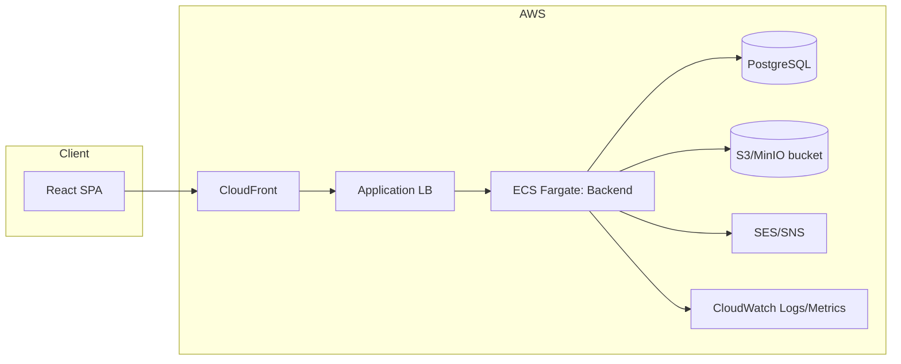

# Research Lifecycle Management Platform

Production-ready blueprint with FastAPI backend, React frontend, PostgreSQL, S3-compatible storage, and Terraform-based AWS deployment. Includes RBAC dashboards for Students, Supervisors, HODs, and Admins plus workflows for milestones, meetings, manuscripts, publications, and notifications.

## Architecture

- **Backend**: FastAPI + SQLAlchemy + PostgreSQL; JWT auth, RBAC, audit logging, async-ready services; object storage via S3-compatible buckets (AWS S3/MinIO).
- **Frontend**: React + Vite + TypeScript; role-based routing and dashboards; responsive layout.
- **Infra**: Docker images per service; docker-compose for local; Terraform for AWS (ECS Fargate, RDS, S3, SES/SNS hooks, CloudFront, ALB, CloudWatch).
- **Security**: HTTPS termination at ALB/CloudFront, TLS to RDS, KMS-at-rest for RDS/S3, JWT + scoped permissions, audit logs, GDPR data subject hooks.
- **Observability**: Structured logging, health checks, metrics hooks, tracing-ready (OpenTelemetry stubs).



## Project Layout

- backend/: FastAPI app, models, services, API, auth, tests, Dockerfile
- frontend/: React + Vite + TS SPA with role dashboards, Dockerfile
- infra/: Terraform for AWS (networking, ECS, RDS, S3, CI/CD hooks)
- docker-compose.yml: Local dev stack (backend, frontend, db, minio)
- .github/workflows/: CI (lint/test/build) and CD (image push/deploy)

## Quickstart (local)

```bash
cp backend/.env.example backend/.env
cp frontend/.env.example frontend/.env
docker compose up --build
```

Backend: http://localhost:8000/docs • Frontend: http://localhost:5173 • MinIO console: http://localhost:9001

## Deployment

- Build & push images via GitHub Actions; Terraform applies infra; ECS Fargate runs backend; frontend served via S3+CloudFront.
- RDS for PostgreSQL (TLS, encrypted). S3 bucket encrypted and versioned. Backups via RDS snapshots + S3 versioning/lifecycle.

## Future Hooks

- AI risk scoring, plagiarism/journal recommendations, WhatsApp/Teams notifications, blockchain notarization (Merkle proofs) extension points ready in services stubs.